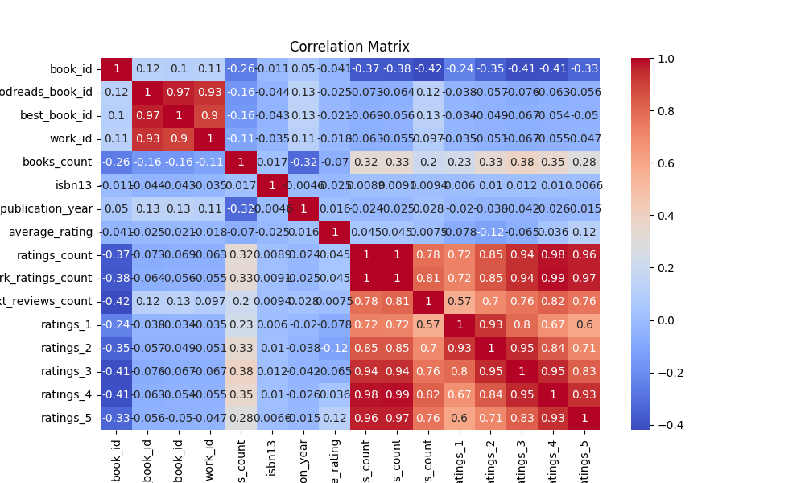

# Book Data Analysis README

This document provides a comprehensive analysis of a book dataset containing a variety of attributes to understand underlying patterns, correlations, and insights that could inform future business decisions.

## Data Summary

The dataset comprises 10,000 entries with numerous features. Below is a summary of the key statistics:

- **Identifiers**: The dataset includes unique identifiers for books, including `book_id`, `goodreads_book_id`, `best_book_id`, and `work_id`.
- **Book Characteristics**:
  - `books_count`: The average number of books by an author is approximately 75.71, with a wide variance (max = 3455).
  - `average_rating`: The mean rating across books is around 4.00, with a high rating count (up to 4780653).
  - `original_publication_year`: Indicates a range of publication years from as early as -1750 to 2017, with an average year of 1981.

### Missing Values
The dataset does not show any missing values in any of the features, suggestive of thorough data collection processes.

## Correlation Analysis

The correlation matrix reveals various relationships between different features. Some noteworthy correlations include:

- **Ratings Count**: A strong negative correlation (-0.373) with `book_id` suggests fewer books may receive more ratings, while a strong positive correlation (0.995) with `work_ratings_count` implies that better-rated works likely accumulate more ratings.
- **Rating Clusters**: The high correlations between different rating levels (e.g., `ratings_1` closely correlates with `ratings_2`, 0.926) indicate that if a book receives one rating, it's likely to garner similar ratings.

## Anomalies & Surprising Patterns

- **Outliers**: The analysis uncovered outliers with a significant discrepancy in ratings. The detection of 500 underperforming books (ratings low) compared to 9500 high-performing ones indicates a polarization in quality. This could be a focus point for marketing strategies aimed at promoting well-rated books or reconsidering the merit of poorly rated titles.

## Clustering Analysis

The dataset's clustering analysis groups the books into three distinct clusters with the following counts:

- Cluster 0: 2544 books
- Cluster 1: 7374 books (majority)
- Cluster 2: 82 books

The centroids indicate that most books cluster closely around common characteristics (likely high ratings), while a small group comprises the atypical, potentially poorer-rated titles. 

### Business Implications
- **Marketing Strategy**: Targeting high-rated books (Cluster 1) for promotions can drive sales. The small Cluster 2 could represent niche genres needing specialized marketing efforts.
- **Inventory Decisions**: Understanding these clusters may refine inventory decisions, emphasizing high-rated books' stock.

## Recommendations for Future Analysis

- **Deeper Sentiment Analysis**: Future analyses should extend into sentiment analysis of reviews, focusing on textual data to determine qualitative aspects missing from quantitative ratings.
- **Identify Genre Relationships**: Incorporating genre data will further clarify patterns related to ratings and publication years, enhancing marketing strategies sensibly.
- **Data Collection Improvements**: Consider attributing finer categorizations to books (sub-genres, themes) to reveal more niche clusters that can drive targeted marketing.

In conclusion, this analysis provides pivotal insights into the dataset that can inform impactful business decisions and future data collection strategies. A concerted focus on high-performing titles while reevaluating low-rated books enables optimized marketing efforts.