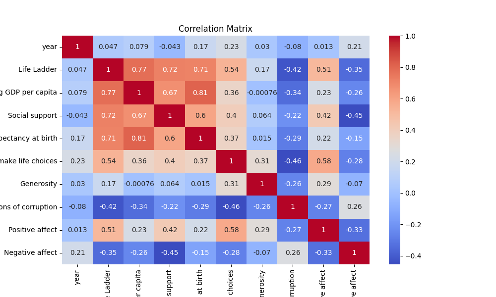

# README.md: Analysis Summary

## Overview
This document summarizes the analysis of a dataset containing various well-being metrics across different countries and years. The dataset includes key indicators such as the Life Ladder score, Log GDP per capita, Social support, and several others. With a total of 2363 entries spanning from 2005 to 2023, this analysis aims to uncover underlying patterns, correlations, and insights that can inform decision-making processes.

## Data Summary
The dataset includes the following key features:
- **Country Name:** 2363 entries recorded for 165 unique countries. The most frequently appearing country is Argentina with 18 occurrences.
- **Year:** The data spans from 2005 to 2023, with an average year of approximately 2014.76.
- **Key Metrics:** The dataset includes various metrics with statistical summaries as follows:

  | Metric                                   | Mean     | Std Dev | Min   | 25%   | 50%   | 75%   | Max   |
  |------------------------------------------|----------|---------|-------|-------|-------|-------|-------|
  | Life Ladder                              | 5.48     | 1.13    | 1.28  | 4.65  | 5.45  | 6.32  | 8.02  |
  | Log GDP per capita                       | 9.40     | 1.15    | 5.53  | 8.52  | 9.49  | 10.38 | 11.68 |
  | Social support                           | 0.81     | 0.12    | 0.23  | 0.74  | 0.83  | 0.90  | 0.99  |
  | Healthy life expectancy at birth         | 63.40    | 6.75    | 6.72  | 59.55 | 64.90 | 68.40 | 74.60 |
  | Freedom to make life choices             | 0.75     | 0.14    | 0.23  | 0.66  | 0.77  | 0.86  | 0.99  |
  | Generosity                               | 0.0001   | 0.16    | -0.34 | -0.11 | -0.02 | 0.09  | 0.70  |
  | Perceptions of corruption                 | 0.74     | 0.18    | 0.04  | 0.70  | 0.79  | 0.86  | 0.98  |
  | Positive affect                          | 0.65     | 0.11    | 0.18  | 0.57  | 0.66  | 0.74  | 0.88  |
  | Negative affect                          | 0.27     | 0.09    | 0.08  | 0.21  | 0.26  | 0.33  | 0.71  |

  Notably, there are no missing values across the dataset.

## Correlation Analysis
The correlation matrix reveals several significant relationships:

- **Strong Correlations:**
  - **Life Ladder and Log GDP per capita** (r = 0.78): This suggests that higher GDP per capita is associated with greater life satisfaction.
  - **Life Ladder and Social support** (r = 0.72): Indicates that social support is crucial for individuals' overall well-being.
  - **Life Ladder and Healthy life expectancy at birth** (r = 0.71): A better healthy life expectancy tends to correlate with higher life satisfaction.

- **Weak or Negative Correlations:**
  - **Freedom to make life choices and Perceptions of corruption** (r = -0.47): A higher sense of corruption is associated with lesser freedom, suggesting that corruption can stifle individuals' choices and freedoms.

## Anomalies and Patterns
Anomalies detected include the significant outlier count in the dataset (2244 positive cases vs. 119 negative cases) indicating that most countries report positively on the life ladder relative to other metrics. 

## Insights from Clustering Analysis
The clustering analysis identified three distinct groups of countries based on their well-being metrics:

1. **Cluster 1 (1113 countries):** Characterized by high scores in Life Ladder, Log GDP per capita, and Social support.
2. **Cluster 2 (835 countries):** Medium scores, indicating average well-being metrics.
3. **Cluster 3 (415 countries):** Low scores across almost all metrics. 

### Potential Business Decisions
- **Targeted Interventions:** Businesses could focus their initiatives in Cluster 3 to improve well-being, potentially partnering with local governments or NGOs.
- **Market Segmentation:** Understanding which clusters show lower metrics can inform product or service offerings tailored to specific countries' needs.

## Recommendations for Future Analysis
- **Data Collection:** Future analysis should aim to collect qualitative data that could provide deeper context to the binary metrics, especially regarding cultural factors influencing well-being.
- **Longitudinal Analysis:** A more robust temporal analysis over the years could reveal trends and shifts in well-being metrics influenced by global events or policies.
- **Addressing Missing Values:** Although there are currently no missing values, establishing a protocol for future data integrity checks will enhance robustness.

## Conclusion
This analysis has revealed significant insights into the factors influencing well-being across countries. Utilizing this information can help stakeholders make informed decisions and implement effective strategies at both local and global levels. Further research should focus on qualitative metrics to enrich the understanding of these dynamics.