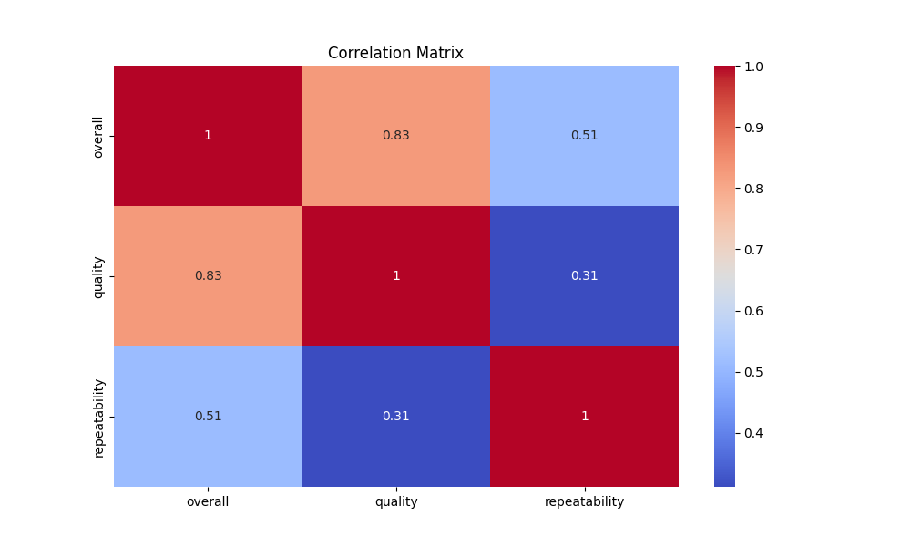

# Analysis of Movie Review Dataset

## Overview
This document provides an overview of the analysis conducted on a movie review dataset containing a total of 2,652 entries. The dataset encompasses various attributes related to movies, such as release date, language, type, title, author, overall rating, quality rating, and repeatability rating.

## Data Summary
The dataset contains the following key metrics:

- **Date**: 2,652 entries, with 2,055 unique dates. The most frequently occurring date is '21-May-06', appearing 107 times.
- **Language**: 2,652 entries with 11 unique languages. *English* is prominent, with 1,306 occurrences.
- **Type**: 2,652 entries across 8 unique types, predominantly *movies* (2,211 entries).
- **Title**: 2,652 titles in total, with 2,312 unique titles. The title *Kanda Naal Mudhal* appears 9 times.
- **By**: 2,652 entries with 1,528 unique contributors. The most prolific contributor is *Kiefer Sutherland*, with 310 reviews.
- **Overall Rating**: Average rating of 3.05 (standard deviation: 0.76), with a minimum of 1 and a maximum of 5.
- **Quality Rating**: Average rating of 3.21 (standard deviation: 0.80).
- **Repeatability**: Average of 1.49, with a range from 1 to 3.

### Missing Values
There are no missing values across any of the attributes, indicating that the dataset is fully populated.

## Correlation Matrix
The correlation analysis indicates strong correlations among ratings:
- **Overall and Quality**: Correlation of 0.83 suggests that higher overall ratings tend to accompany higher quality ratings.
- **Quality and Repeatability**: A moderate correlation of 0.31 indicates that movies rated highly on quality are somewhat more likely to be rated more repeatably.
- **Overall and Repeatability**: Correlation of 0.51 suggests a solid relationship between overall enjoyment and repeat viewing.

### Anomalies and Surprising Patterns
One surprising finding is the high count of outlier reviews: 2,536 reviews are classified as positive anomalies (+1) while only 116 are negative anomalies (-1). This could suggest a strong bias towards favorable reviews among viewers.

## Clustering Analysis
The clustering analysis yielded three distinct clusters based on the ratings:
1. **Cluster 0**: 1,315 entries
2. **Cluster 1**: 568 entries
3. **Cluster 2**: 769 entries

The centroids of these clusters indicate variations in ratings profiles, suggesting potential audience segmentation. Marketing strategies could be tailored to target specific audiences within these clusters.

## Business Insights
The strong association between overall ratings and quality can inform potential decisions:
- Investing in movies that garner higher quality ratings could lead to increased viewer satisfaction and repeat viewership.
- The popularity of certain contributors, like Kiefer Sutherland, implies that leveraging these figures in promotional campaigns may enhance visibility and ratings.

## Future Recommendations
1. **Further Exploration**: Conduct longitudinal studies to track how ratings and review patterns evolve over time.
2. **Improved Data Collection**: Additional demographic information could enhance analysis, enabling the identification of trends across different audience segments.
3. **Explore External Factors**: Investigating the impact of marketing campaigns, awards, or social media trends on reviews could provide deeper insights.

In conclusion, this analysis of the movie review dataset reveals significant insights into viewer preferences and highlights areas for potential strategic focus to enhance viewer engagement and satisfaction.